# Documentation

__Disclaimer__: The author of this document is not a professional security practitionner. 

The architecture and proposed solution can only be considered as an illustration of common security practices.

## Context

This is a public Merchant website where an anonymous customer can add items to a cart. When he orders he have to fulfill the delivery address and then issue the payment. Once the payment is received the order is sent by mail.

## Architecture

The proposed architecture is a "Single Page Application" accessible on internet.   

### Initial Architecture

The Customer access the "Single Page Application" using a web browser. The access is anonymous. The application connects to a backend, the backend store the data in a database.

The simplified diagram:


### Initial Feedback 

The initial architecture does not take into account the context of the business. Using a "single page application" and "database" technical concepts are not enough to determine who are the various stakeholders nor what do they need to do. Once the "Work" is defined it’s easier to determine how the Merchant Website can developed and describe the components and their relationship.

#### Starting from the customer

The customer need to browse the available products, select them in a cart, fulfill the delivery address and pay. 

```mermaid
flowchart LR
    subgraph 'Online Shopping Use Cases'
    uc1((Browse Products))
    uc2((Select Items in Cart))
    uc3((Issue Order))
    uc4((Fulfill delivery address))
    uc5((Pay Order))
    end
    customer[Customer👤]

    customer-->uc1
    customer-->uc2
    customer-->uc3
    uc3-. include .->uc4
    uc3-. include .->uc5
```



A data flow diagram (__DFD__) maps out the flow of information for any process or system. 

They are very useful to describe the business cases:

```mermaid
flowchart LR
  classDef sensitive fill:#f96
  subgraph Customer Interaction
    customer[Customer👤]
    DeliveryAddress
    SessionId
    SearchResult
    SearchCriteria
    ProductId2
    ProductQty
    CreditCardInfo
  end
  administrator[Administrator👤]  
  Product
  ProductId
  subgraph Product Domain
    add_product((Add Product))
    update_product((Update Product))
    remove_product((Remove Product))
    search_product((Search Product))
    ProductR[[Product Repository]]
  end
  subgraph Cart Domain
    Cart
    create_cart((Create Cart))
    add_product_cart((Add Product))
    remove_product_cart((Remove Product))
    update_product_cart((Update Product))
    view_product_cart((View Cart))
  end
  subgraph Order Domain
    OrderR[Order Repository]
    fulfill_delivery_address((Fulfill Delivery Address))
    fulfill_delivery_address --> OrderR
    fulfill_delivery_address --> AddressFulfilled
    issue_order((Issue Order))
    issue_order --> OrderR
    issue_order --> PaymentRequest
    PaymentRequest
    confirm_order((Confirm Order))
    confirm_order --> OrderR
    AddressFulfilled --> confirm_order
  end
  subgraph Payment Domain
    PaymentR[[Payment Repository]]
    request_payment((Request Payment))
    PaymentConfirmation
    request_payment --> PaymentConfirmation
    request_payment --> PaymentR
  end
  customer -.-> SearchCriteria
  SearchCriteria --> search_product
  ProductR --> search_product
  search_product --> SearchResult
  SearchResult -.-> customer
  add_product --> ProductR
  Product --> add_product
  update_product --> ProductR
  Product --> update_product
  remove_product --> ProductR
  ProductId --> remove_product
  
  customer -.-> SessionId
  SessionId --> create_cart
  SessionId --> add_product_cart
  SessionId --> remove_product_cart
  SessionId --> update_product_cart
  SessionId --> issue_order
  SessionId --> fulfill_delivery_address
  SessionId --> view_product_cart
  SessionId --> search_product
  Cart --> view_product_cart
  administrator -.-> Product
  administrator -.-> ProductId
  ProductQty
  ProductId2[ProductId]
  ProductId2 --> add_product_cart
  ProductQty --> add_product_cart
  ProductQty --> update_product_cart
  ProductId2 --> remove_product_cart
  customer -.-> ProductId2
  customer -.-> ProductQty
  add_product_cart --> Cart
  remove_product_cart --> Cart
  ProductId2 --> update_product_cart --> Cart
  Cart --> issue_order
  CreditCardInfo:::sensitive
  customer -.-> CreditCardInfo
  CreditCardInfo --> request_payment
  PaymentRequest --> request_payment
  PaymentConfirmation --> confirm_order
  DeliveryAddress:::sensitive
  customer -.-> DeliveryAddress
  DeliveryAddress --> fulfill_delivery_address
```



### Revised Architecture

The simplified diagram:


## Securing the Merchant Website 

Defense in depth principles are enforced at all the OSI levels. 

### Session Layer

When the merchant application first connects to the Merchant website, a unique intemperable session identifier is provided by the API Gateway. The session identifier is a JWT provided by the identity provider. 

he JWT is systematically verified by the API Gateway and no traffic without session identifier is allowed after this component. 

### Presentation Layer 

This layer consists of formatting, conversion, translation and encryption. 
All this processing is done inside the SPA Merchant Application. 

### Application Layer 

The real work is executed in the services ecosystem, deep inside the merchant platform. 
Strict security policies are defined and enforced. 

The common identified risks are 
* Confidentiality
  * risk: product search and cart content could allow inference of sensitive data (genre, sickness, pregnancy)
  * mitigation: https is enforced
* Integrity
  * risk: cart could be updated by another user, order delivery address could be updated by another user
  * mitigation: access to all cart / order data is restricted by session identifier
- Availability
  * risk: all APIs being accessible via internet, a denial of service is possible
  * mitigation: the WAF and API Gateway limit API calls related to a same abusing client IP Address, client session or identified attack pattern
- Auditability
  * risk: abuse could not be properly attributed to an attacker
  * mitigation: IP address, session information, API calls are properly logged, logs are encrypted and not accessible except by authorize personal and legitimate use according to GDPR / CCAP

#### Product Service

No additionnal risk identified for Customer access. 

#### Cart Service

No additional risk identified for Customer access

#### Order Service

No addtional risk identified for Customer access

#### Payment Service

Payment service risk is delegated to third party provider. Due diligence is to be applied during the provider selection process. 

Additional "non payment" risk should be properly investigated, quantified and mitigated. 

## Security Policies

The Security Policies are the following. 

### Search Product

There is no limitation in the search product. 
A "pass-through" policy is netherveless defined. 

An alternative is to limit the product search to requests having a session identifier.

```
// allow search to product
@id("ProductSearch.session")
permit (
  principal,
  action in
    [OnlineStore::Action::"searchProduct"],
  resource
)
when { context has sessionId };
```

### Create Cart

The only limitation to cart creation is the existence of a session identifier. 

```
// allow create cart
@id("CartCreate.session")
permit (
  principal,
  action in
    [OnlineStore::Action::"createCart"],
  resource
)
when { context has sessionId };
```

### Add / Remove / Update Cart

The cart Add / Remove / Update access is limited to the session which have created the cart initially. 

```
// allow add / remove / update cart
@id("CartAddRemoveUpdate")
permit (
  principal,
  action in
    [OnlineStore::Action::"createCart"],
  resource
)
when { context has sessionId && resource has sessionId && context.sessionId == resource.sessionId };
```

### Issue Order

The issue order is limited to the session which have created the cart initially.

```
```

### Fulfill Delivery Address

The fulfill delivery address is limited to the session which have created the cart initially.

```
```

### Confirm Order

The confirm order is limited to the payment system. 

```
```

It is assumed that the business rule "Payment Request correspond to the Payment Confirmation" is properly verified by the Order Service. As it is a business rule it is not enforced by the permission system. 

### Request Payment

The request payment is implemented by a third party.

It is assumed that a proper authentication process is defined and security controls are enforced. A security policy is out of scope for this service. 
